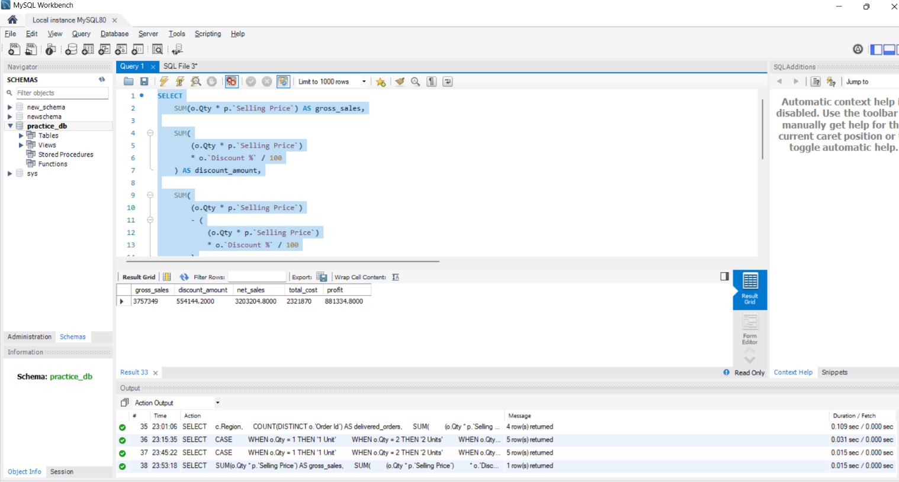

# SQL Sales Analysis

## 📊 Project Overview

This project analyzes e-commerce sales data using MySQL to understand sales performance, customer behavior, product performance, discounts, order status, and profitability.

The project uses SQL to transform transactional data into meaningful business information that can support data-driven decision making.

## 🎯 Business Objective

The main objective of this project is to analyze sales transactions and answer important business questions related to:

- Sales performance
- Customer performance
- Product performance
- Discounts
- Order status
- Revenue and profitability
- Regional performance

## 📁 Dataset

The dataset contains transactional sales information including:

### Orders
- Order ID
- Order Date
- Customer ID
- Product ID
- Quantity
- Discount %
- Payment Mode
- Shipping Mode
- Order Status

### Customers
- Customer ID
- Customer Name
- Gender
- Age
- City
- Region
- State

### Products
- Product ID
- Product information
- Cost Price
- Selling Price

The tables were connected using relevant keys such as Customer ID and Product ID.

## 🛠️ Tools Used

- MySQL
- MySQL Workbench
- SQL

## 📚 SQL Concepts Used

The project demonstrates practical use of:

- SELECT and filtering
- Aggregate functions
- GROUP BY and HAVING
- JOINs
- CASE statements
- NULL handling
- Data cleaning
- CTEs
- Subqueries
- Window functions
- UNION and UNION ALL
- Conditional aggregation
- Date and text functions
- Business calculations

## 💰 Key Business Calculations

The analysis includes calculations such as:

- Gross Sales
- Discount Amount
- Net Sales
- Total Cost
- Profit
- Profit Margin
- Order-level and customer-level sales
- Product-level performance

## 🔍 Business Questions

The analysis is designed to answer questions such as:

1. What are the total sales and total profit?
2. Which products generate the highest sales?
3. Which customers contribute the most revenue?
4. How do discounts affect net sales and profit?
5. How are orders distributed across different order statuses?
6. Which regions perform best?
7. What is the overall profit margin?
8. How can transactional data be transformed into useful business insights?

## 📈 Key Insights

### 📊 Business Performance Dashboard




### 💰 Overall Business Performance

- Generated ₹57.49 lakh in net sales and ₹15.62 lakh in profit.
- Overall profit margin was approximately 27.17%.
- Total discount amount was ₹10.27 lakh, highlighting the importance of monitoring discount strategies.

### 📦 Order Status Performance

- Out of 1,000 orders, 579 were delivered, 212 were returned and 209 were cancelled.
- Only 57.9% of orders were successfully delivered.
- 42.1% of orders were either returned or cancelled, indicating an opportunity for further operational investigation.

### 👥 Customer Performance

- Customer 7 generated the highest delivered net sales among the analyzed customers at ₹67,081.30 and generated ₹21,381.30 in profit.
- The top 10 customers contributed approximately 15.82% of delivered net sales, indicating relatively distributed customer contribution.

### 🛍️ Product Performance

- Sneakers 3 generated the highest product profit at ₹56,647.45.
- Sneakers 6 achieved the highest profit margin among the top 10 profit-generating products at 39.37%.
- 9 of the top 10 profit-generating products belonged to the Fashion category.

### 🗂️ Category Performance

- Fashion was the strongest category with ₹11.61 lakh in net sales, ₹4.02 lakh in profit and a 34.59% profit margin.
- Fashion achieved this performance with 12 active products, while Electronics had 24 active products but a lower 22.96% margin.

### 📍 Regional Performance

- South generated the highest net sales at ₹12.63 lakh and had the highest AOV at ₹5,690.48.
- East had the highest regional profit margin at 27.81%, although the difference between regional margins was relatively small.

### 🏷️ Discount Impact

- Profit margin declined consistently as discount levels increased.
- Margin decreased from 37.19% at 0% discount to 13.01% at 30% discount.
- Higher discounts were associated with lower profitability, although this analysis does not establish causation.

### 🛒 Order Size

- Average order value increased from ₹1,798.52 for 1-unit orders to ₹8,779.86 for orders containing 5+ units.
- Profit margins remained broadly stable between approximately 26% and 28% across order-size groups.
## 💡 Business Recommendations

Based on the analysis, the following actions could help improve business performance:

### 1. Review High-Discount Strategies
- Profit margin declined from 37.19% at 0% discount to 13.01% at 30% discount.
- Review products receiving high discounts and establish minimum acceptable profit-margin thresholds.
- Use targeted discounts instead of applying deep discounts broadly.

### 2. Investigate Returns and Cancellations
- Only 57.9% of orders were delivered successfully, while 21.2% were returned and 20.9% were cancelled.
- Investigate the major reasons behind returns and cancellations.
- Analyze these issues by product, category, region and order status to identify operational problem areas.

### 3. Focus on High-Performing Categories
- Fashion generated the highest net sales and profit with a 34.59% profit margin.
- Consider increasing inventory availability and promotional focus for high-performing products within this category.
- At the same time, review lower-margin categories for pricing and cost optimization opportunities.

### 4. Encourage Larger Basket Sizes
- AOV increased from ₹1,798.52 for 1-unit orders to ₹8,779.86 for orders containing 5+ units.
- Explore cross-selling, product bundles and "frequently bought together" recommendations to encourage larger baskets.
- Monitor whether these strategies increase basket size without significantly reducing margins.

### 5. Leverage Regional Performance
- South generated the highest net sales, while East recorded the highest regional profit margin.
- Evaluate whether successful practices from stronger-performing regions can be applied to other regions.
- Use regional performance data to guide inventory, pricing and promotional decisions.

### 6. Monitor Product-Level Profitability
- High sales volume does not necessarily mean the highest profitability.
- Track both net sales and profit margin when evaluating product performance.
- Prioritize products that combine strong demand with healthy margins.
## 📁 Project Structure

```text
sql-sales-analysis/
│
├── README.md
│
└── sql/
    ├── 01_data_cleaning.sql
    └── 02_sales_analysis.sql
